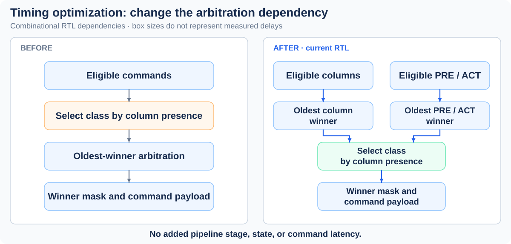

# DRAM Memory Controller RTL

A synthesizable **SystemVerilog controller for a simplified, single-channel,
four-bank DRAM command protocol**, with configurable queue depth and three
scheduling policies. The project covers request ordering, bank timing,
backpressure, starvation protection, and measured ASIC area/timing tradeoffs.

[Five-minute design review](docs/portfolio-review.md) ·
[Architecture](docs/architecture.md) ·
[Verification](docs/verification-plan.md) ·
[Reproduce](docs/reproduce.md)


*Requests keep their transaction slots until the host consumes the response.
Bank timing legality and scheduling policy are separate blocks.*

## Results at a glance

| Study | Measured result | Evidence |
|---|---|---|
| **Frozen v1.1 scheduling study** | Always-ready random traffic: **0.146 → 0.419 responses/cycle**, Strict-FCFS → FR-FCFS, averaged across 20 seeds | [Multi-seed results](docs/performance-stability.md) |
| **Frozen v1.1 aging tradeoff** | Hot/cold p99 latency **333 → 137 cycles**; throughput **0.481 → 0.462 responses/cycle** | [Workload and metric definitions](docs/results.md#performance) |
| **Latest mapped timing** | Q=16 / 3 ns: **+50.054 ps setup slack**; 4 ns: **+55.773 ps**. **Zero setup/hold violations** at both points | [Paired mapping and proofs](docs/experiments/setup-margin-experiment.md) |
| **Current RTL verification** | **300 regression runs**, **3,003,000 accepted transactions**, and **42 directed/workload/reset/corner simulations**, plus unit checks | [Source-matched validation](results/parallel_arbitration/validation_summary.json) |

Each study has its own baseline; the frozen v1.1 performance results are historical.
The [experiment index](docs/experiments/README.md) retains earlier area improvements,
hold-repair measurements and optimization tradeoffs.

## Scope and limitations

The latest ASIC timing uses Synopsys Design Compiler with the GSCL45nm typical library,
ideal clocks and pre-layout mapping, at Q=16 / FR-FCFS+aging / 3 ns and 4 ns.
Setup and hold pass at these two points, but capacitance violations remain:
the [diagnosis](docs/experiments/capacitance-diagnosis.md) confirms explicit
zero-capacitance limits in the source and loaded library, and loads below the
associated Liberty source's delay-table grid. These supplied-library results
require further low-load characterization; routed timing signoff and checks across
corners remain future work.

## Architecture and design choices

- **Separate legality from policy.** Per-bank timing and preparation ownership
  determine which commands can issue. Strict-FCFS provides a head-of-line
  baseline; FR-FCFS prefers ready columns; aging protects the oldest aged
  request's command service, at a measured throughput cost.
- **Preserve ordering where required.** Commands and responses preserve
  acceptance order for the same address; independent addresses may bypass. An
  explicit older-than matrix avoids sequence-number wraparound but costs
  quadratic storage/logic as queue depth grows.
- **Handle backpressure without losing completion capacity.** Requests retain
  their slots until response consumption. The response register holds stalled
  payloads stable and can consume/refill from an already-eligible independent
  completion on the same edge. The isolated tCCD=1 study sustains one response
  per cycle; default tCCD=2 still limits column issue to 0.5/cycle.
- **Optimize a measured dependency.** Critical-path analysis led to computing
  column and PRE/ACT oldest winners in parallel, then selecting the command
  class. This removes a serial arbitration dependency without adding pipeline
  stages or state. A deliberately wrong class selector is rejected by equivalence.



*The change moves class selection after parallel winner computation. This is an
RTL dependency sketch; box sizes do not represent measured delays. See the
[matched timing experiment](docs/experiments/parallel-arbitration-experiment.md).*

Default RTL: 16 outstanding slots, 32-bit words, 256 rows × 64 columns per bank,
three-cycle read latency, and FR-FCFS with aging. Timing parameters are illustrative
cycle counts. The interface supports full-word requests and tagged responses;
PHY, refresh, training, bursts, ECC and JEDEC compliance are outside this project.
See the [protocol contract](docs/protocol-and-timing.md) for ordering and reset.

## Verification and reproducibility

The current optimization is checked with **nine whole-controller equivalence
configurations** (Q=1/3/16 × three policies) and **120 complete baseline/current
cycle-trace pairs**, in addition to the simulations above. Property checks include
three depth-12 controller BMC tasks with symbolic data and two focused unbounded
control proofs in reduced configurations. This is not an all-parameter unbounded
proof of data correctness. See [proof scope](docs/verification-plan.md).

The latest two mapped changes also have paired functional checks and rejected
negative controls. Setup-margin mapping compares every physical register's
next-state and clock functions plus all original outputs, without assuming
numbered combinational wires remain equivalent.

Published evidence retains source/report hashes and matched synthesis conditions.
A [fresh-checkout audit](docs/reproduce.md#fresh-checkout-audit) reproduces local
checks, equivalence, traces and properties; its regression portion is a 15-run
sample. The full 300-run result is recorded separately.

Start from the repository root with the evidence audit, which needs only Python
and Git. Simulation needs Python 3.10+, Verilator supporting
`--binary --timing --assert`, a C++ compiler and make. Run commands sequentially:

```sh
make check-evidence                      # inspect published hashes and measurements
make lint
make smoke
make test
make regress SEEDS=5 N=1000 JOBS=2        # 15-run regression sample
```

For equivalence and traces, install Yosys, then run:

```sh
make formal-parallel                    # all nine equivalence configurations
make compare-parallel                   # 120 complete trace pairs
```

`make formal` runs the five property tasks with SymbiYosys. The
[reproduction guide](docs/reproduce.md) documents tested tools, full regression,
historical checkpoints and optional synthesis. New mapped PPA requires licensed
Synopsys tools and the matching library. `make report` republishes historical
artifacts and can overwrite frozen evidence; it is not part of the quickstart.

## Repository guide

| Location | Contents |
|---|---|
| `rtl/`, `tb/` | Current controller RTL, simulation testbenches and DRAM model |
| `formal/` | Property harnesses, task configurations and historical reference RTL |
| `synth/` | RTL manifest, constraints and DC / PrimeTime flows |
| [`scripts/`](scripts/README.md) | Daily checks, synthesis tools and historical report publishers |
| [`docs/`](docs/README.md) | Design contracts, verification, reproduction and result explanations |
| [`docs/experiments/`](docs/experiments/README.md) | Optimization history, timing diagnoses and rejected alternatives |
| [`results/`](results/README.md) | Published summaries, selected reports and frozen source snapshots |
| `build/`, `.tools/`, `local_notes/` | Ignored working outputs, local dependencies and private notes |

For a technical review, start with the [five-minute walkthrough](docs/portfolio-review.md),
then inspect the [current experiment](docs/experiments/parallel-arbitration-experiment.md)
and [latest mapped setup-margin result](docs/experiments/setup-margin-experiment.md).
The [experiment index](docs/experiments/README.md) preserves
both adopted changes and rejected alternatives, including their tradeoffs.
