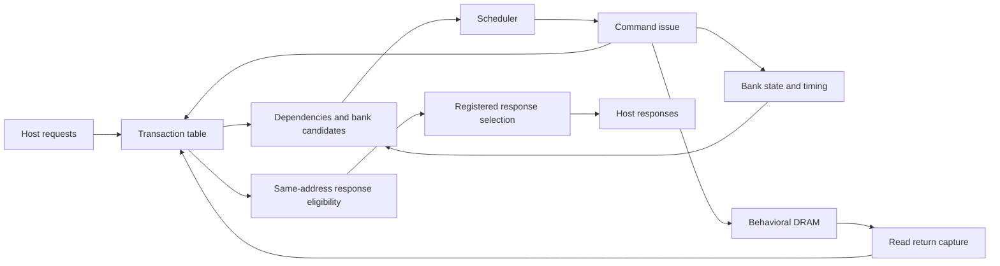

# Frozen v1 architecture — response-refill amendment

The candidate-decode, shared-address, and candidate-mask optimizations preserve this protocol and
cycle-level policy. Their measured implementation changes are documented in
[scheduler optimization](experiments/scheduler-optimization.md) and
[address sharing](experiments/address-sharing-optimization.md), and
[candidate masks](experiments/candidate-mask-optimization.md); the v1.1 measurements remain
separate from the current RTL's mapping results.
The [command-mask and storage optimization](experiments/command-mask-optimization.md)
also preserves the protocol and cycle behavior.
The [remaining command-path analysis](experiments/command-path-3ns.md) examines that selected
implementation and proposes the next scheduler experiment without changing RTL.
The resulting [parallel-arbitration implementation](experiments/parallel-arbitration-experiment.md)
is now selected. Column and PRE/ACT oldest winners are computed independently,
then selected using column presence; the protocol and cycle behavior are unchanged.

## Goals and boundaries

Demonstrate RTL microarchitecture, bank-level parallelism, timing constraints,
Strict-FCFS versus FR-FCFS, starvation protection, read/write ordering, independent
verification, reproducible performance experiments, and ASIC timing/area analysis.

One channel, exactly four banks, power-of-two configurable rows and columns, open
page, ACT/READ/WRITE/PRE, tRCD/tRP/tRAS/tCCD/tWR. No PHY, initialization/training,
refresh/retention, multi-rank/channel, bank groups, bursts, byte enables, ECC,
coherence, AXI, turnaround timings, or JEDEC compliance. This isolates the command
scheduling problem without pretending to implement a production DDR subsystem.

## Default configuration

| Setting | Default |
|---|---|
| Rows / columns per bank | 256 / 64 words |
| Data / host tag widths | 32 / 8 bits |
| Outstanding slots | 16 |
| READ latency | 3 cycles |
| tRCD / tRP / tRAS / tCCD / tWR | 3 / 3 / 6 / 2 / 3 cycles |
| Aging threshold | 128 cycles |
| Scheduler | FR-FCFS with aging (`SCHED_POLICY=1`, `AGING_ENABLE=1`) |

Timings are illustrative cycle counts, not a DRAM speed bin. Address width is
`log2(ROWS)+log2(COLS)+2`. Word address fields are `[row | column | bank]`, so the
default capacity is 256 KiB. Consecutive words rotate across banks; stride four
stays in a bank. Rows/columns must be powers of two >=2, queue depth positive,
data width a positive multiple of eight, and all timing values positive.

## Data flow and decomposition

| Block | Responsibility and tradeoff |
|---|---|
| `mc_top` | Integration, address slicing, shared address-equality matrix, command issue |
| `mc_transaction_table` | Owns allocation, data, completion, exact acceptance-order matrix; slots remain reserved until responses retire |
| `mc_bank_tracker` | Logical bank state, timers, preparation owner; legality independent of policy |
| `mc_candidates` | Same-address pending dependency filtering and one candidate per bank |
| `mc_scheduler_strict_fcfs` | Explicit HOL baseline, not a universal definition of FCFS |
| `mc_scheduler_frfcfs` | Ready-column preference and emergency aging protection |
| `mc_response` | Same-address response eligibility and stable held response; no global retirement order |
| Behavioral model and monitors | Simulation only, independent timestamp and acceptance-order references |

Flat packed-vector module ports support the selected Verilator, Yosys, and DC
front ends. Metadata and data are separate vectors. The older-than matrix costs
quadratic bits/logic but avoids sequence wraparound assumptions for a small queue.

The top computes one full-address comparison per unordered slot pair and mirrors
it into `same_address[i*Q_DEPTH+j]`; diagonal entries are constant one. Both
`mc_candidates` and `mc_response` consume this combinational matrix. Command
dependencies qualify it with `pending`, response dependencies with `occupied`.
No dependency lifetime, register, or pipeline stage is shared or added. Equality
sharing reduces duplicated logic across the synthesis hierarchy; it does not
remove the quadratic order matrix or pairwise dependency checks.

Slot lifecycle: `FREE -> PENDING -> READ_INFLIGHT -> DONE -> FREE`, or
`FREE -> PENDING -> DONE -> FREE` for WRITE. Occupied slots reserve completion
capacity even if the host stops accepting responses. Free-slot allocation uses
pre-edge state: a retiring transaction slot is not reused on the same edge.
Completion bits and read-result data now use fixed-slot update decodes, preserving
the original priority when events coincide: retirement, allocation, write issue,
then read return. All other table state retains its implementation.

The response holding register can be consumed and refilled on the same edge.
Arbitration chooses the oldest pre-edge response-eligible slot other than the
currently held slot. With independent completed transactions available and ready
asserted, responses can handshake every cycle. This amendment removes the original
global selection bubble without adding storage or a global retirement buffer.
Eligibility still includes all occupied predecessors: a same-address successor
unblocked by this edge's retirement cannot be selected on this edge. If there is
no independent replacement, that conservative same-address bubble remains.
Under backpressure the held slot and payload remain unchanged. The default tCCD=2
still bounds sustained column-command throughput at 0.5/cycle; tCCD=1 experiments
isolate the response path's one-per-cycle capability.

## Bank state and preparation ownership

Stored state is OPEN/CLOSED plus open-row address. ACT opens a closed bank; PRE
closes an open bank; column commands keep it open. Activating/precharging are
derived timing conditions, not extra logical states.

Closed-bank requests need ACT then READ/WRITE; conflicts need PRE then ACT then
READ/WRITE. PRE or ACT establishes a bank preparation owner until that request's
column command. This forbids speculative abandonment and row thrashing, trading
some intra-bank flexibility for a clearer progress argument.

## Timing strategy

Four saturating countdowns per bank enforce ACT-to-column, PRE-to-ACT,
ACT-to-PRE, and WRITE-to-PRE. One global countdown enforces column-to-column
spacing. Issue at C with interval T loads T-1; permission is tested using the
pre-edge zero state, so first permission is C+T. Event loads override decrements.
No additional real-DRAM timings are implied; see the protocol contract.

## Strict Request FCFS

Use `strict_fcfs` in code/configuration and Strict-FCFS (HOL baseline) in reports.
Choose the globally oldest PENDING request and issue its next command if legal.
Otherwise issue nothing, including to independent banks. Advance after its column
command, without waiting for its response. This deliberately demonstrates HOL blocking.

## FR-FCFS

Memory eligibility requires PENDING, no older PENDING same-address request, and
respect for bank ownership. For each bank choose the owner, else oldest eligible
open-row hit, else oldest eligible request. Pending hits retain their open row
even while timing-blocked. Globally choose oldest legal READ/WRITE, else oldest
legal ACT/PRE, else idle. A blocked candidate does not prevent another bank's
legal candidate. PRE is demand-driven, with no speculative closure.

The current candidate/scheduler interface uses a Q-bit mask instead of four
encoded slot indices. Each bank marks its winner, with a highest-slot-index
fallback if multiple incomparable winners exist, then the four masks are ORed.
The scheduler qualifies mask bits with legality, uses each slot's address bank
for aging suppression, and retains its global column-first/oldest-first choice.
The mask changes combinational representation without changing the ordering of
candidate selection and legality checks or adding state.

FR-FCFS also exports a final command payload mask directly from its winning
choices. `mc_top` selects operation, address, and write data with masked ORs over
fixed slot slices; the encoded slot still drives transaction and bank-owner
updates. The mask preserves highest-index fallback and aging service override.
With no winner it selects slot zero, retaining the original invalid-cycle
payload; it is not a valid-command flag and is not gated by reset. Strict-FCFS
decodes its existing selected slot into the payload mask, preserving blocked-oldest
payloads even while command valid is low.

## Aging and bounded service

Each pending slot's age saturates at AGE_LIMIT. Exact acceptance order breaks ties.
Protect the oldest aged pending request through column issue. Finish a different
existing owner of its bank first. Block other requests in that bank and unrelated
column commands globally. Other-bank ACT/PRE can use otherwise idle cycles.

`B = tRAS+tWR+tRP+tRCD+tCCD+8`. Verification budget: protected service <=2B;
acceptance-to-column <= AGE_LIMIT+2*Q_DEPTH*B. The latter is a conservative bound
for accepted requests under a conforming memory interface and no reset. Response
consumption needs eventual host readiness. This is request progress protection,
not source-level bandwidth fairness. Disabled aging remains available to expose
the throughput/fairness tradeoff.

## Read/write and response ordering

WRITE commits at command issue; READ snapshots at command issue. Same-address
RAW/WAR/WAW/RAR commands preserve acceptance order. Command dependencies end at
column issue. Responses preserve the same-address acceptance order through
consumption: a DONE entry remains ineligible while any older occupied entry has
its address. Independent addresses may bypass. See the worked protocol examples.
No write draining or forwarding is required in this abstraction. Read-return and
write-completion events can update distinct slots simultaneously.

## Verification and performance

Use Verilator, independent timestamp checks, acceptance-order reference memory,
per-address response checks, policy reference, and bounded service monitors.
Focused SymbiYosys complements simulation; record bounded checks separately from
unbounded proofs. Release regression: 100 fixed seeds x 10,000 workload requests
x three policies, full drain and accounting. Corner and illegal-model tests are
separate. See verification-plan.md for details.

Workloads cover locality, conflicts, random accesses, bank interleaving, HOL,
hot/cold competition, read/write mixes, same-address chains, and load/backpressure.
Track command/response rates, admission/queue/completion/response-order/arbitration/
backpressure latency, distributions, locality at first attributable command,
ACT/PRE overhead, occupancy, and aging. Use identical sequences with fixed warm-up
and complete measured drains. Never claim FR-FCFS universally wins.

## Synthesis and timing awareness

Local Yosys is optional sanity checking. Final evidence uses UCSB Design Compiler,
lab technology libraries, SDC, mapped area/timing and critical paths. Sweep
20/10/8/5/4/3/2 ns for each policy at Q=16, plus Q=4/8/32 at 5 ns. Keep corner,
I/O constraints, and compile effort fixed. PrimeTime is optional. Report fastest
passing tested frequency, not an exact Fmax or post-layout result. Potential
critical paths are dependencies, oldest selection, response eligibility, and data
muxes. Do not pipeline without preserving/revalidating command legality.

## Milestones and required reviews

M0: frozen contracts and workflow. M1: independent model. M2: transaction and
response lifecycles. M3: Strict-FCFS. M4: FR-FCFS. M5: aging/formal. M6: performance.
M7: UCSB ASIC evidence. M8: reproducible portfolio release.

Before changing RTL review separate dependency lifetimes, delayed READ followed
by WRITE, held response stability, timing boundaries, aging behind a younger bank
owner, concurrent completion/retirement, and matched synthesis assumptions.
Architecture changes require a public contract update and the append-only private
engineering record described by repository instructions.
