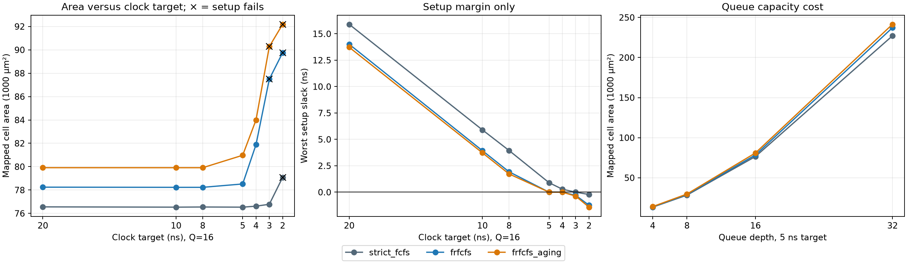

# Frozen v1.1 ASIC comparison sweep

These measurements retain the original v1.1 RTL. Subsequent implementation
measurements are recorded in [scheduler optimization](scheduler-optimization.md)
and [shared address comparisons](address-sharing-optimization.md), followed by
the [candidate-mask timing experiment](candidate-mask-optimization.md).
The subsequent [storage timing study](storage-timing-experiment.md) reports
focused internal setup/reset hold diagnosis and two RTL alternatives.
Current selected RTL and its measurements are in
[command-mask plus storage optimization](command-mask-optimization.md).

All **30 distinct Design Compiler runs** completed; **25/30** meet their target setup constraint. RTL, architecture, library, and SDC were not changed. A setup pass does not waive hold or capacitance violations.

## Diagnostics completed before the sweep

[All 14 baseline hold paths](../results/dc_sweep/baseline_hold_paths.csv) are register-to-register feedback paths: 12 transaction DONE bits and two bank timing counters. Input-to-register, register-to-output, and other classifications each have zero entries. Worst hold slack is −0.002538 ns.

The baseline’s 5,556 max-capacitance violations all use zero allowed load. The inherited gscl45nm database and companion Liberty both specify NAND2X1/Y max_capacitance=0. No library, constraint, or RTL edits were used to suppress these violations.

## Fixed experiment conditions

- DC R-2020.09-SP4; `compile -map_effort medium` in every run.
- Target library: `${TECH_LIBRARY_DIR}/gscl45nm.db`; link library is `*` followed by that same database.
- Typical corner, process factor 1, 1.1 V, 27°C; time 1 ns, capacitance 1 pF. Same configuration hash and database identity as the accepted baseline.
- I/O maximum/minimum delays 1/0 ns; uncertainty 0.1 ns (unchanged for setup and hold); input transition 0.1 ns; output load 10 fF; no false or multicycle paths.
- Seven-file controller-only manifest; rows=256, columns=64, data=32 bits, fixed DRAM cycle timings/read latency/aging threshold. Only the requested scheduler, queue depth, and clock target vary.
- Three isolated policy workspaces, one sequential stream of ten fresh RTL compiles each. The shared Q16/5 ns points serve both matrices; no duplicate counting. No existing baseline result was substituted for a fresh run.
- No wire-load model or extracted interconnect; ideal clocks. Cell area is not physical core area. No RTL optimization, retiming, hold repair, library substitution, or capacitance waiver was performed.

## Fastest tested setup-passing target at Q=16

| Policy | Smallest passing tested period (ns) | Corresponding target (MHz) |
|---|---:|---:|
| `strict_fcfs` | 3 | 333.33 |
| `frfcfs` | 4 | 250.00 |
| `frfcfs_aging` | 4 | 250.00 |

**These are tested setup-passing targets, not exact maximum frequencies or full timing/DRC signoff.** No untested interval between clock points is inferred.

## A — Clock sweep at Q=16

| Policy | Clock ns | Area µm² | Worst setup ns | WNS ns | TNS ns | Setup violations | Worst hold ns | Hold count | Unconstrained | Setup passes |
|---|---:|---:|---:|---:|---:|---:|---:|---:|---:|---|
| `strict_fcfs` | 20 | 76559.25 | 15.900673 | 0.000000 | 0.000000 | 0 | -0.002538 | 11 | 0 | yes |
| `strict_fcfs` | 10 | 76533.91 | 5.900458 | 0.000000 | 0.000000 | 0 | -0.002538 | 11 | 0 | yes |
| `strict_fcfs` | 8 | 76547.99 | 3.948955 | 0.000000 | 0.000000 | 0 | -0.002538 | 11 | 0 | yes |
| `strict_fcfs` | 5 | 76533.91 | 0.900459 | 0.000000 | 0.000000 | 0 | -0.002538 | 11 | 0 | yes |
| `strict_fcfs` | 4 | 76618.85 | 0.282022 | 0.000000 | 0.000000 | 0 | -0.002538 | 11 | 0 | yes |
| `strict_fcfs` | 3 | 76780.76 | 0.000016 | 0.000000 | 0.000000 | 0 | -0.002538 | 11 | 0 | yes |
| `strict_fcfs` | 2 | 79083.62 | -0.220549 | -0.220549 | -0.592932 | 3 | -0.035258 | 12 | 0 | no |
| `frfcfs` | 20 | 78244.98 | 14.010666 | 0.000000 | 0.000000 | 0 | -0.002538 | 11 | 0 | yes |
| `frfcfs` | 10 | 78231.37 | 3.931531 | 0.000000 | 0.000000 | 0 | -0.002538 | 11 | 0 | yes |
| `frfcfs` | 8 | 78231.37 | 1.931531 | 0.000000 | 0.000000 | 0 | -0.002538 | 11 | 0 | yes |
| `frfcfs` | 5 | 78519.52 | 0.001791 | 0.000000 | 0.000000 | 0 | -0.002538 | 11 | 0 | yes |
| `frfcfs` | 4 | 81883.46 | 0.000085 | 0.000000 | 0.000000 | 0 | -0.050676 | 20 | 0 | yes |
| `frfcfs` | 3 | 87495.82 | -0.297604 | -0.297604 | -15.126799 | 62 | -0.014064 | 257 | 0 | no |
| `frfcfs` | 2 | 89754.09 | -1.233525 | -1.233525 | -517.775752 | 804 | -0.036871 | 259 | 0 | no |
| `frfcfs_aging` | 20 | 79912.40 | 13.727005 | 0.000000 | 0.000000 | 0 | -0.002538 | 15 | 0 | yes |
| `frfcfs_aging` | 10 | 79910.99 | 3.727005 | 0.000000 | 0.000000 | 0 | -0.002538 | 15 | 0 | yes |
| `frfcfs_aging` | 8 | 79910.99 | 1.727006 | 0.000000 | 0.000000 | 0 | -0.002538 | 15 | 0 | yes |
| `frfcfs_aging` | 5 | 80975.37 | 0.001615 | 0.000000 | 0.000000 | 0 | -0.002538 | 14 | 0 | yes |
| `frfcfs_aging` | 4 | 83993.90 | 0.000617 | 0.000000 | 0.000000 | 0 | -0.002538 | 11 | 0 | yes |
| `frfcfs_aging` | 3 | 90281.59 | -0.375142 | -0.375142 | -18.655097 | 51 | -0.014064 | 256 | 0 | no |
| `frfcfs_aging` | 2 | 92186.47 | -1.419572 | -1.419572 | -683.875466 | 706 | -0.030616 | 257 | 0 | no |

## B — Queue-depth comparison at 5 ns

| Policy | Q | Total area µm² | Combinational µm² | Sequential µm² | Worst setup ns | Setup passes |
|---|---:|---:|---:|---:|---:|---|
| `strict_fcfs` | 4 | 13332.81 | 9240.05 | 4092.77 | 1.980860 | yes |
| `strict_fcfs` | 8 | 28340.56 | 20609.78 | 7730.78 | 2.163412 | yes |
| `strict_fcfs` | 16 | 76533.91 | 60825.03 | 15708.88 | 0.900459 | yes |
| `strict_fcfs` | 32 | 227142.13 | 192477.29 | 34664.84 | 0.007261 | yes |
| `frfcfs` | 4 | 13618.15 | 9501.45 | 4116.70 | 0.842307 | yes |
| `frfcfs` | 8 | 28976.93 | 21214.24 | 7762.69 | 0.329056 | yes |
| `frfcfs` | 16 | 78519.52 | 62770.75 | 15748.77 | 0.001791 | yes |
| `frfcfs` | 32 | 237259.30 | 202546.59 | 34712.71 | 0.000025 | yes |
| `frfcfs_aging` | 4 | 14036.76 | 9920.06 | 4116.70 | 0.709369 | yes |
| `frfcfs_aging` | 8 | 29707.16 | 21944.47 | 7762.69 | 0.144343 | yes |
| `frfcfs_aging` | 16 | 80975.37 | 65226.60 | 15748.77 | 0.001615 | yes |
| `frfcfs_aging` | 32 | 241478.78 | 206766.07 | 34712.71 | 0.000001 | yes |

All fields for both matrices—including warning classifications, setup WNS/TNS, hold counts, and unconstrained counts—are in the CSV/JSON below.



## Architectural tradeoffs

**Policy cost at Q=16 and 5 ns is modest compared with queue-capacity cost.**
Strict Request FCFS maps to 76,533.91 µm², FR-FCFS to 78,519.52 µm² (+2.59%),
and FR-FCFS with aging to 80,975.37 µm² (another +3.13%, or +5.80% versus Strict
Request FCFS). Aging's area increment at this point is combinational; the two
FR-FCFS runs have the same reported sequential area. These are the costs of the
existing hierarchical implementation under this compile flow, not isolated ideal
scheduler circuits. Their bank-parallelism and fairness behavior is documented
separately in the architecture and performance reports.

**The scheduling flexibility has a timing cost.** At Q=16, Strict Request FCFS
passes the tested 3 ns point but fails 2 ns. Both FR-FCFS variants pass 4 ns but
fail 3 ns and 2 ns. Their tight passing paths traverse address/dependency and bank
candidate selection, global arbitration, and command payload selection. Strict
Request FCFS instead encounters transaction admission/free-slot selection as its
critical path at 3 ns. Raising mapping area at 3 ns does not close the FR-FCFS
paths: area rises to 87,495.82 / 90,281.59 µm² without / with aging, while WNS is
−0.297604 / −0.375142 ns. The fastest tested targets are not exact maximum
frequencies, and this experiment does not rescale abstract DRAM workloads into
validated physical DDR bandwidth.

**Increasing Q from 16 to 32 roughly triples area while doubling capacity.**
At 5 ns, Q=32 areas are 227,142.13 / 237,259.30 / 241,478.78 µm² for
strict_fcfs / frfcfs / frfcfs_aging: 2.97× / 3.02× / 2.98× their respective
Q=16 totals. Across Q=4 to Q=32, area grows about 17.0–17.4× for 8× capacity.
The growth is predominantly combinational; for Strict Request FCFS, Q16→Q32
combinational area grows 60,825.03→192,477.29 µm² while sequential area grows
15,708.88→34,664.84 µm². The exact ordering matrix, pairwise dependencies and
response eligibility, arbitration, and wider payload selection explain this
superlinear growth. This sweep measures their cost; it does not measure additional
workload benefit from deeper queues.

**A setup pass here can have effectively no implementation margin.** The Q=32
5 ns worst setup slacks are +0.007261 / +0.000025 / +0.000001 ns. The latter two
are especially close to zero at the report precision. No physical parasitics are
included, and hold/electrical constraints remain violated. Also, Strict Request
FCFS's 2 ns critical path is reset masking to rsp_valid: fixed 1 ns input delay,
1 ns output delay, and 0.1 ns uncertainty already exceed 2 ns before logic delay.
That is an I/O-budget limit in this experiment, not a reason to relax the frozen
constraints or infer a different untested clock result.

The fresh Q16/5 ns FR-FCFS-with-aging run exactly reproduces the accepted
baseline's mapped area, worst setup slack, and worst hold slack. No RTL,
architecture, library limit, or SDC was changed to obtain any result.

Queue capacity expands transaction payload storage and the exact older-than matrix. Same-address dependency/response comparisons scale across pairs of slots; candidate and response arbitration plus payload selection add combinational work. This explains why deeper queues carry both storage and selection costs, rather than only a linear FIFO cost. Mapped area can vary nonmonotonically with target period because DC chooses and buffers gates differently; the architecture is unchanged.

## Critical paths

| Policy / Q / ns | Startpoint | Endpoint | Path logic inferred from mapped hierarchy |
|---|---|---|---|
| `strict_fcfs` / 16 / 3 | `table_i/occupied_reg[0]` | `table_i/addresses_reg[169]` | occupancy/free-slot admission logic -> request-ready/acceptance gating -> allocation/address-register write-enable logic |
| `strict_fcfs` / 32 / 5 | `table_i/occupied_reg[2]` | `table_i/addresses_reg[478]` | occupancy/free-slot admission logic -> allocation/address-register write-enable logic |
| `frfcfs` / 16 / 4 | `table_i/addresses_reg[247]` | `cmd_wdata[2]` | transaction-table registers/data logic -> dependency/row-hit and bank-candidate selection -> FR-FCFS arbitration -> command write-data mux/output |
| `frfcfs` / 32 / 5 | `table_i/addresses_reg[86]` | `cmd_row[1]` | transaction-table registers/data logic -> dependency/row-hit and bank-candidate selection -> FR-FCFS arbitration -> command decode/output |
| `frfcfs_aging` / 16 / 4 | `table_i/addresses_reg[241]` | `cmd_wdata[22]` | transaction-table registers/data logic -> dependency/row-hit and bank-candidate selection -> FR-FCFS arbitration -> command write-data mux/output |
| `frfcfs_aging` / 32 / 5 | `table_i/occupied_reg[2]` | `table_i/addresses_reg[319]` | occupancy/free-slot admission logic -> allocation/address-register write-enable logic |

Every run’s ten reported setup paths, startpoints/endpoints, and hierarchy-based descriptions are retained in JSON; the worst path and description also appear in CSV. These descriptions identify the mapped blocks on the measured path, not a gate-level equivalence proof.

## Remaining violations and warning accounting

Across the matrix, hold-violating endpoint counts range from 6 to 259. Max-capacitance counts range from 558 to 20694; 186081 of 186081 reported capacitance violations have a zero allowed-load limit. All runs report zero unconstrained endpoints.

Warnings are recorded separately for synthesis, design checks, and timing checks to avoid treating repeated messages as distinct faults. Classes include signed/unsigned conversions (VER-318), unused logic/nets (LINT-1/LINT-2), unused hierarchical port bits (LINT-28), and high-fanout clocks (TIM-134). With aging disabled, LINT-52 reports protection_active tied to zero and VO-4 reports emitted assignment constructs; the mapped netlist contains `assign protection_active = 1'b0;`. These are retained in the per-run warning files and JSON counts. No final flow Error lines were accepted.

Setup WNS is min(0, worst setup slack). TNS sums the six-decimal negative endpoint slacks in report_constraint; violation counts are cross-checked against report_qor. Hold slack is reported even for runs without a hold violation. Unconstrained endpoint count is the checked report count, not an assumption based only on SDC presence.

## Reproduction and evidence

```sh
python3 scripts/lab_bundle.py
# Set LAB_SSH_TARGET and LAB_BASELINE_DIR privately; optionally LAB_SSH_CONTROL_PATH.
# Uses the authenticated connection and the verified baseline lab_config.tcl:
python3 scripts/dc_sweep.py
# Rebuild summaries without rerunning synthesis:
python3 scripts/dc_sweep_report.py
.tools/venv/bin/python scripts/dc_sweep_publish.py
```

- [CSV: all 30 points](../results/dc_sweep/summary.csv)
- [JSON: metrics, paths, violations, warnings and provenance](../results/dc_sweep/summary.json)
- [Frozen RTL/SDC hashes](../results/dc_sweep/frozen_inputs.json)
- [Baseline hold-path CSV](../results/dc_sweep/baseline_hold_paths.csv)
- [Published per-run reports](../results/dc_sweep/reports/)
- [Synthesis setup](#synthesis-setup)

Raw transcripts, full constraint reports and mapped Verilog/DDC are retained locally in `build/dc_sweep/runs/`; remote session paths/commands are in `build/dc_sweep/session.json`.

<!-- technical-reference -->

## Synthesis setup

Use Python 3.10+ and an authorized Synopsys installation. The measured flow used
Design Compiler R-2020.09-SP4 and Python 3.11. Load your site's tool/license
environment, then create the ignored `synth/lab_config.tcl` from
`synth/lab_config.example.tcl`. Supply the target database, search directory,
internal library name, operating condition, and library time/capacitance units.
The measured library is `gscl45nm`, typical, process 1, 1.1 V, 27°C; one time unit
is 1 ns and one capacitance unit is 1 pF (`LIB_CAP_FF=1000`). Use the same target
list for linking, preceded by `*`. Library files and site configuration are not
included in the repository.

`make lab-bundle` packages the seven controller RTL files, explicit manifest,
SDC, DC/PT scripts, runner, configuration example, and this synthesis guide.
Transfer the bundle to the authorized workspace and extract it. Testbenches,
formal harnesses, workloads, and local files are excluded. Run there:

```sh
python3 scripts/synth.py dc --lab --config synth/lab_config.tcl
# One Q=16, FR-FCFS+aging, 5 ns point:
python3 scripts/synth.py dc --lab --baseline --config synth/lab_config.tcl
# Optional PrimeTime, using the same library (not executed for the published results):
python3 scripts/synth.py pt --lab --config synth/lab_config.tcl \
  --run build/synth/dc/frfcfs_aging_q16_5ns
```

Use `--policy strict_fcfs`, `--policy frfcfs`, or `--policy frfcfs_aging` for one
policy's ten points. The optional remote orchestrator takes `LAB_SSH_TARGET`,
`LAB_BASELINE_DIR` (containing the verified `synth/lab_config.tcl`), and optional
`LAB_SSH_CONTROL_PATH` from the environment. Keep these site details private.
It expects Python 3.11 at `/usr/bin/python3.11` on the remote host.

Only `synth/rtl_files.f` is analyzed, with `mc_top` and `SYNTHESIS` defined.
Synchronous reset is constrained; do not import asynchronous-reset false paths.
Each fresh compile records source/configuration hashes and preserves mapped
netlist/SDC, area, setup/hold, QoR, constraint, and design/timing reports.
Report regeneration needs the full downloaded raw directories under
`build/dc_sweep/runs/`, not only the curated public subset. Original report hashes
refer to pre-redaction artifacts; public report copies omit private site strings.
Check regenerated metadata for site details before sharing it.
