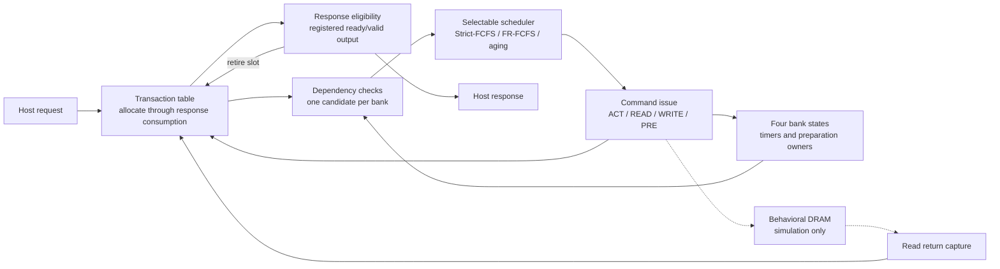
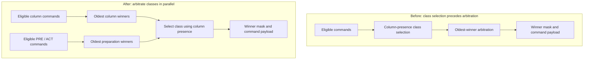

# Controller design review: a five-minute walkthrough

**Outcome:** a verified simplified DRAM controller with three scheduling policies
and a measured RTL optimization that removes 50 Q16/3 ns setup violations.
The current implementation passes pre-layout setup at 3 ns with only 0.038 ps
margin. Hold remains failing; this is an RTL and synthesis study, not a signed-off
DDR controller. Start with [reproduction](reproduce.md) to inspect or run it.

## 1. Architecture and the design decisions

The controller has one channel and four banks. A request holds its transaction
slot until the host consumes its response. Same-address operations and responses
preserve acceptance order; independent addresses can bypass. The older-than
matrix makes ordering explicit and avoids sequence-number wraparound, at the
cost of quadratic storage/logic as queue depth grows.

Strict-FCFS is an explicit head-of-line baseline: a blocked oldest request stalls
command issue. FR-FCFS prefers ready columns and then the oldest eligible request.
Aging protects an old request's command service, including draining a bank's
existing preparation owner. Host response consumption still requires readiness.
Bank timing legality and scheduling policy are separate concerns.

## 2. Diagnose a path, then change the dependency

The previous selected implementation (`9d40e16`) still failed 3 ns by 68.773 ps.
Its worst address-register-to-command path arrived at 1.968773 ns against a
1.900000 ns budget: 3 ns minus 1 ns output delay and 0.1 ns clock uncertainty.
Read-only DDC queries showed that candidates and arbitration consumed 70.72%
of that arrival time. Another nearly equal path used a different command mask,
so fixing one high-fanout mask alone would leave the other path failing.

This diagram describes the RTL dependency, not a measured gate-for-gate mapping.
The change adds no pipeline, state or cycle latency. It preserves highest-slot
tie priority, aging overrides and slot-zero payload when no command is valid.
Class selection must use **column presence**, not column-winner existence:
an arbitrary cyclic ordering matrix can have columns but no oldest winner.
A deliberately incorrect selector is rejected by equivalence.

## 3. Measure against the same baseline and constraints

| Q16 FR-FCFS+aging | Previous selected RTL | Parallel arbitration |
|---|---:|---:|
| 3 ns area (µm²) | 71,720.770984 | **70,362.616764 (−1.89%)** |
| 3 ns worst setup slack (ns) | −0.068773 | **+0.000038** |
| 3 ns setup endpoints / TNS (ns) | 50 / −3.396384 | **0 / 0** |
| 3 ns internal setup margin (ns) | +0.002394 | +0.000186 |
| 3 ns worst hold slack (ns) / endpoints | −0.000661 / 8 | −0.000659 / 8 |
| 4 ns area (µm²) | 65,996.718912 | **65,709.507315 (−0.44%)** |
| 4 ns worst setup slack (ns) | +0.000109 | **+0.001984** |
| 4 ns worst hold slack (ns) / endpoints | −0.000659 / 2 | −0.000659 / 2 |

Both targets use Synopsys DC R-2020.09-SP4, GSCL45nm typical at 1.1 V/27°C,
the same SDC and medium mapping effort, and 1,974 sequential cells. Two fresh
trial mappings are compared with two reused baseline mappings; each clock
target has its own netlist. Source/library/flow hashes and full violation lists
are retained. The smaller internal setup margin is a real tradeoff, even though
it satisfies the predeclared requirement of zero internal setup failures.

I also kept rejected experiments. The earlier direct-mask-only trial improved
worst setup but worsened TNS and hold count; a folded-default-mask trial worsened
hold. Fixed-slot storage alone failed its earlier screen, while a separately
measured combination later qualified. These are different baselines and trials;
their percentage improvements cannot be added together.

## 4. Establish what is correct, and what is still unproven

- **Implementation equivalence:** Q=1/3/16 across all three policies, nine
  whole-controller matched-node SAT checks, zero unproven cells; a wrong-class
  negative control is rejected. This is the documented partitioned proof scope.
- **Simulation:** 120 complete baseline/current event-trace pairs; 42 integrated
  workload/reset/parameter-corner cases and model/scheduler/response unit checks;
  300 regression runs with 3,003,000 accepted transactions.
- **Properties:** three depth-12 controller BMC tasks with symbolic data, plus
  reduced unbounded bank/progress control proofs. The reduced progress proof
  is not a general unbounded data-correctness or all-parameter proof.
- **Boundary:** 3 ns setup passes by only 0.038 ps; hold and zero-limit library
  capacitance violations remain. No placement/routing, power, PHY, refresh,
  JEDEC compliance, or production-frequency claim is made.

The next engineering phase would address hold, increase setup margin and, with
a suitable physical flow, evaluate placed/routed timing. This portfolio phase
is complete as a reproducible RTL and pre-layout optimization study.

## Evidence to open during a review

- [Interface, timing and ordering contract](protocol-and-timing.md)
- [Pre-change critical-path diagnosis](experiments/command-path-3ns.md)
- [Final experiment, adoption criteria and limitations](experiments/parallel-arbitration-experiment.md)
- [Current machine-readable evidence](../results/parallel_arbitration/summary.json)
- [Verification scope](verification-plan.md) and [reproduction commands](reproduce.md)
- [Rejected direct-mask alternatives](experiments/command-mask-optimization.md) and
  [storage study](experiments/storage-timing-experiment.md)

An accurate resume description is: “Designed and verified a four-bank DRAM
command scheduler with FR-FCFS and aging; parallelized command-class arbitration
to eliminate 50 setup violations at a 3 ns pre-layout target while reducing
mapped area 1.89%, supported by equivalence checks and 3.0M simulated transactions.”
Keep the simplified-protocol, pre-layout and remaining-hold qualifications in
the project description and be ready to explain them.
