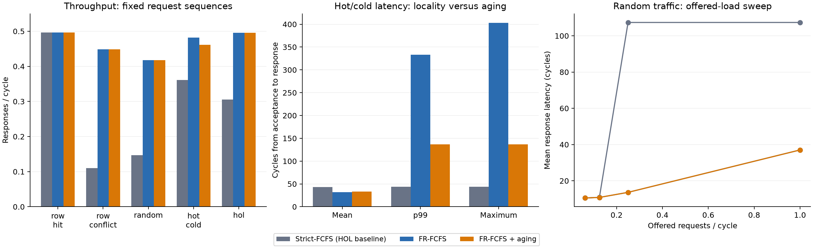

# Frozen v1.1 local results

This report records the v1.1 baseline. Subsequent candidate-decode and shared-address
RTL changes, fresh verification, and matched synthesis measurements are recorded
separately in [scheduler optimization](scheduler-optimization.md) and
[address sharing](address-sharing-optimization.md), followed by the current
[candidate-mask timing experiment](candidate-mask-optimization.md) and the
current [command-mask plus storage optimization](command-mask-optimization.md).

The verification and performance results below come from executed local runs.
The subsequent [UCSB Design Compiler baseline](asic-results.md) maps the unchanged
v1.1 RTL at 5 ns: 80,975.37 µm² cell area and +0.001615 ns worst setup slack.
It is not timing/DRC clean: 14 hold and 5,556 library max-capacitance violations
remain. The subsequent [30-point frozen ASIC sweep](asic-results.md) is complete:
25 targets pass setup, with hold and inherited capacitance violations retained.
PrimeTime has not been run.

## Verification

- Verilator: `Verilator 5.046 2026-02-28 rev vUNKNOWN-built20260228`.
- Yosys: `Yosys 0.68+post (git sha1 c12172fbae8af5e20f6fb52e3d4e92d56ed587b6, Release, AppleClang clang++ 16.0.0.16000026)`.
- 300 regression runs passed; 3,003,000 accepted transactions,
  comprising 100 seeds × 10,000 workload requests × three policies plus directed preludes.
- 42 directed/workload/reset/parameter-corner runs passed.
- Two legal model boundary traces, eight expected-failure traces, and the defensive
  existing-owner aging arbitration test passed.
- The response-refill test passed: eight consecutive independent handshakes,
  stable stalled payloads, ordered same-address consumption, and reset cancellation.
- RTL lint passed. Optional generic Yosys synthesis completed; it is a synthesizability check.

Aggregated coverage counts (events/cycles, not percentages):

```json
{
  "protection": 1471,
  "same_addr_block": 21287036,
  "independent_bypass": 3113098,
  "overlap": 407,
  "full": 342,
  "bank_overlap": 1617766,
  "protected_owner_block": 0
}
```

Same-address blocking counts blocked transaction-cycles. The zero existing-owner
count reflects the normal bank-preparation invariant; its defensive branch is
tested separately by `tb_scheduler`, as described in the verification plan.

## Formal evidence and limits

| Task | Mode | Depth | Outcome |
|---|---|---|---|
| strict | bmc | 12 | PASS |
| frfcfs | bmc | 12 | PASS |
| aging | bmc | 12 | PASS |
| bank | prove | unbounded | PASS |
| progress | prove | unbounded | PASS |

Integrated BMC covers symbolic data, addresses, operation mix, tags, and backpressure
for a two-slot configuration. It is not an unbounded data-correctness proof.
The bank proof establishes timing-permission equivalence to independent elapsed-cycle
counters under legal issue assumptions. The progress proof checks mixed reads/writes,
all four banks, two slots, fixed one-cycle reads, small positive timing values and
age threshold three. Payloads are zero; response readiness is unrestricted. It proves
the conservative 63-cycle pending-service bound for this reduced control configuration,
plus ownership/ordering/capacity assertions. It does not prove all parameter settings.

Earlier integrated 80-cycle attempts with Z3 and ABC timed out. Splitting focused
control proofs from bounded symbolic-data checks made the final suite tractable.

## Performance

Simulation configuration: four banks, eight rows × eight columns per bank, 32-bit
words, 16 outstanding slots, read latency three; timing 3/3/6/2/3 and aging 128.
Each experiment uses seed 42, 200 warm-up requests, 2,000 measured requests, fixed
request sequences, and complete drain. The table uses always-ready responses and
one offered request per cycle. Throughput includes the measured cohort's drain.

| Workload | Policy | Responses/cycle | Mean latency | p99 | Maximum |
|---|---|---:|---:|---:|---:|
| row_hit | Strict-FCFS (HOL baseline) | 0.496 | 31.0 | 32 | 32 |
| row_hit | FR-FCFS | 0.496 | 31.0 | 32 | 32 |
| row_hit | FR-FCFS + aging | 0.496 | 31.0 | 32 | 32 |
| row_conflict | Strict-FCFS (HOL baseline) | 0.110 | 143.0 | 143 | 143 |
| row_conflict | FR-FCFS | 0.449 | 34.4 | 68 | 68 |
| row_conflict | FR-FCFS + aging | 0.449 | 34.4 | 68 | 68 |
| random | Strict-FCFS (HOL baseline) | 0.147 | 107.4 | 125 | 131 |
| random | FR-FCFS | 0.417 | 37.0 | 72 | 93 |
| random | FR-FCFS + aging | 0.417 | 37.0 | 72 | 93 |
| hot_cold | Strict-FCFS (HOL baseline) | 0.361 | 43.0 | 44 | 44 |
| hot_cold | FR-FCFS | 0.481 | 31.9 | 333 | 403 |
| hot_cold | FR-FCFS + aging | 0.462 | 33.3 | 137 | 137 |
| hol | Strict-FCFS (HOL baseline) | 0.305 | 51.0 | 51 | 51 |
| hol | FR-FCFS | 0.495 | 30.9 | 102 | 105 |
| hol | FR-FCFS + aging | 0.495 | 30.9 | 102 | 105 |



[Annotated command traces](traces.md) show a row conflict, overlapping bank
activations, and a measured aging intervention from these runs.

The response holding register now consumes and refills on the same edge for
already-eligible independent transactions. The default tCCD=2 limits sustained
column-command throughput to 0.5/cycle; row-hit traffic approaches that limit across
all policies. A separate tCCD=1 capacity experiment isolates the response path's
one-per-cycle capability; see [response-path throughput](#response-path-throughput).
FR-FCFS
improves locality and bank overlap on conflicts and random traffic. Hot/cold traffic
shows its tail-latency cost; aging trades some throughput for a shorter tail.
At low offered load, latency reflects individual service rather than a full queue.
These are abstract word-transfer results, not physical DDR bandwidth measurements.

## Reproduce

The subsequent [frozen v1.1 stability study](performance-stability.md) covers 20
seeds for random, hot/cold, and HOL traffic at 100%, 50%, and 20% ready across all
three policies. Its 540 final-design runs and 60 historical random/50% paired runs
all passed. The FR-FCFS random/50% p99 increase is consistent across all 20 seeds
(mean +8.8 cycles), alongside 28.6% higher throughput and 23.1% lower mean latency.
The report includes all per-seed metrics and explains the deterministic hot/cold
and HOL stimulus limitation. Controller RTL and testbench hashes are unchanged.

```sh
make lint test
make regress SEEDS=100 N=10000 JOBS=4
make formal
make perf
make synth-local-sanity
make lab-bundle
make report
```

Machine-readable public results and RTL hashes are in `results/local_summary.json`.
Detailed commands, source hashes, logs and CSV events are retained locally under
`build/`. The report script reads the run summaries and event traces. Regenerate in a
disposable checkout to preserve the published measurements.

<!-- technical-reference -->

## Response-path throughput

The holding register consumes and refills on the same edge from an already-eligible
independent completion. The held slot is excluded from replacement selection;
backpressure holds the payload stable. Same-address eligibility uses pre-edge
occupancy, so a newly unblocked successor retains the conservative one-cycle
selection delay. No global retirement buffer or additional registers are needed.

The isolated row-hit test uses 64 columns, Q=16, read latency 3, seed 42,
200 warm-up and 5,000 measured requests, a 75/25 read/write mix, and always-ready
responses. All three policies give the same results:

| tCCD | Response-window rate, before → after | Cohort rate, before → after | Longest consecutive handshakes, before → after |
|---|---:|---:|---:|
| 1 | 0.500000 → 1.000000 | 0.498504 → 0.997606 | 1 → 5000 |
| 2 | 0.500000 → 0.499850 | 0.498504 → 0.498405 | 1 → 3 |

Response-window rate is `(N−1)/(last response−first response)`; cohort rate includes
initial queue latency and drain. Default tCCD=2 remains a column-command bottleneck.
The directed response test requires eight consecutive handshakes, checks stable
stalled payloads and same-address ordering, and rejects the former selection bubble.

Removing the bubble changes slot availability and therefore scheduler-visible
requests. Better throughput does not guarantee a better p99. The
[multi-seed study](performance-stability.md) quantifies this tradeoff under backpressure.
[Before/after measurements](../results/response_refill_comparison.json) retain the
full workload comparison and [capacity results](../results/response_capacity_after.json).

Generic Yosys synthesis changed total cells from 28,923 to 29,582 and response
cells from 6,320 to 6,717; total flops stayed at 1,974, response flops at 5, and
latches at zero. Response topological depth changed from 30 to 29. Mapping context
also changed other generic cell counts: these are structural observations, not
mapped ASIC area or an estimate of frequency.

To reproduce the capacity and historical comparison after the main verification,
performance, and optional Yosys commands:

```sh
python3 scripts/response_capacity.py --label after
mkdir -p build/response_refill
python3 scripts/response_refill_report.py
```

The detailed generated comparison is local at `build/response_refill/report.md`.
Published before-run JSON and the reverse patch support historical comparison;
reconstruct historical RTL only in a separate copy, as the stability runner does.

## Workloads

The generator lives in tb/tb_top.sv; scripts/run.py names and configures each case.
The sequence-indexed xorshift32 RNG is fixed by `+seed`; response stalls do not
change request addresses/data. All policies receive identical sequences.

| ID | Name | Pattern |
|---|---|---|
| 0 | row_hit | Bank 0, one row, cycling columns |
| 1 | sequential | Consecutive word addresses, low bank-bit interleaving |
| 2 | row_conflict | Two alternating bank-0 rows |
| 3 | random | Uniform address bits |
| 4 | hot_cold | Fifteen hot-row requests per cold conflicting request |
| 5 | hol | Periodic bank-0 conflicts mixed with other-bank hits |
| 6 | read_only | Random, 100% reads |
| 7 | read_write_50 | Random, alternating reads and writes |
| 8 | write_only | Random, 100% writes |
| 9 | same_address | One address, mixed RAW/WAR/WAW/RAR chains |

Default mix is 75% reads/25% writes. `make perf` uses seed 42, 200 warm-up requests,
2,000 measured requests, and excludes the ten directed prelude requests from metrics.
It adds random-workload offered intervals of 4/8/16 cycles and response-ready duty
cycles of 80/50/20%. Input can offer up to one request per cycle.

CSV events: A acceptance; C command; D internal completion; P protection activation;
E protection completion/duration; I classified idle cycle; O occupancy, preparing-bank
count and per-bank open/owner masks; R consumed response with sequence/address/operation and
offered/accepted/issued/completed/eligible/presented timestamps plus locality class.
Per-run metrics.json records distributions; run.json preserves the exact command.
Measurement throughput uses the first measured acceptance through the last measured
response, including drain. ACT/PRE per request use attributable request sequence IDs.
Row-hit classification is at the request's first attributable command, never at
its inevitably open-row column command.

## Tool setup

- Verilator 5.046 (2026-02-28).
- Yosys 0.68+post, git c12172fbae8af5e20f6fb52e3d4e92d56ed587b6.
- SymbiYosys source commit b1a1e98cba941ec8433f8dc27f416cd7bb7f14be.
- ABC supplied with Yosys; BMC3 and PDR engines.
- Python 3.13; Click 8.5.0 for the local SymbiYosys checkout.
- Matplotlib 3.11.2 and NumPy 2.5.3 for standalone figures.

Example isolated formal setup from the project root:

```sh
mkdir -p .tools
git clone https://github.com/YosysHQ/sby.git .tools/sby
git -C .tools/sby checkout b1a1e98cba941ec8433f8dc27f416cd7bb7f14be
python3 -m venv .tools/venv
.tools/venv/bin/pip install click==8.5.0
make formal
```

For figures, install into the same isolated environment and use the report target:

```sh
.tools/venv/bin/pip install -r scripts/requirements-plot.txt
make report
```

The isolated environment also avoids mixing host Python binary architectures.

Yosys and its ABC executable must be on PATH. The runner prefers an installed
`sby`, otherwise it uses the ignored local checkout and virtual environment.
Z3 was available but the integrated symbolic-data run timed out with it; final
tasks use ABC and do not require Z3. The local checkout is a dependency, not
vendored project source. The CI smoke job uses the distribution's Verilator;
run metadata identifies the actual simulator version used for each result.
